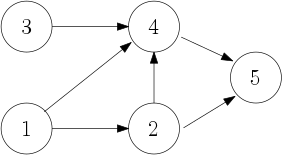
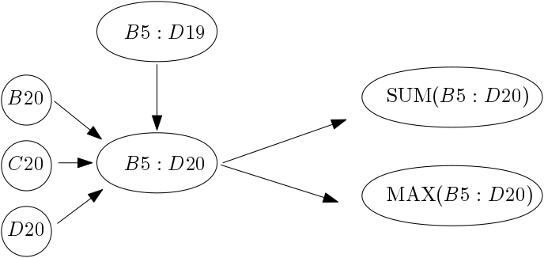

# HyperFormula

HyperFormula is a JavaScript engine for efficient processing of formulas in spreadsheets.

## Table of Contents
1. [What to use it for?](#what-to-use-it-for)
2. [Overview](#overview)
3. [Examples](#examples)
4. [Installation](#installation)
5. [Demos](#demos)
5. [Basic usage](#basic-usage)
      - [Config file](#config-file)
      - [hyperformula-convert](#hyperformula-convert)
      - [hyperformula-diff](#hyperformula-diff)
      - [Source code](#source-code)
6. [Errors](#errors)
7. [Detailed description](#detailed-description)
      - [Parsing - grammar](#parsing---grammar)
      - [Repetitive ASTs](#repetitive-asts)
      - [Relative addressing](#relative-addressing)
      - [Handling ranges](#handling-ranges)
8. [Implementing custom procedures](#implementing-custom-procedures)
9. [Dependencies](#dependencies)
10. [License](#license)


## What to use it for

You can use HyperFormula for processing spreadsheet-like data and formulas in various ways:
- as a standalone tool
- as a service via an API, embedded in a larger system
- as a spreadsheet, while combined with suitable UI

## Overview

Processing a spreadsheet consists of three phases:

1. Parsing and construction of ASTs - we need to parse the provided formulas and represent them as a so-called Abstract Syntax Tree. For example, the AST for
`7*3-SIN(A5)` looks as follows:


2. Construction of the dependency graph - we need to understand the relationship between the cells and find the order of processing them. For example if we have `C1=A1+B1`, then we need to process first `A1` and `B1` and then `C1`. Such an order of processing cells - also known as topological order - exists if and only if there is no cycle in the dependency graph. There can be many such orders, see an example:



3. Evaluation - it is crucial to evaluate all cells efficiently. For simple expressions there is not much room for maneuver, but for instance spreadsheets with plenty of SUMs on large ranges needs more attention.

A more detailed description is provided below.

## Examples


You can find more examples in [examples/](examples/) folder.

## Installation

Note: make sure to use a recent (at least 10.x) version of node js. We have observed a significant performance drop even in some 8.x versions.

Install yarn:

```
npm install -g yarn
```

Install all dependencies:

```
make setup
```

Run tests to make sure that everything is working properly:
```
make test
```

See other useful `make` commands available in [Makefile](Makefile) or listed with `make help` command.

## Demos

### Browser Benchmarks demo

1. Make [Installation](#installation) step above
2. `make bundle`, to build code artifacts
3. `cd dist/browser && live-server` to run the server with demos, which will be available under [http://localhost:8080]


## Basic usage

You can use the following script to process a CSV file with formulas and output a CSV file with values.
If you want to compare results of our engine with values computed by another spreadsheet, you can use the second script.

### Config file

First, there are various parameters that you might want to edit in the [Config file](src/Config.ts):

- CSV_DELIMITER - delimiter between entries in CSV file (default: '.'),
- FUNCTION_ARG_SEPARATOR - separator between the arguments of functions (default: ','),
- LANGUAGE - language, currently only English and Polish are supported (default: 'EN'). Other languages can be easily added by inserting translations of function names in corresponding files of [src/interpreter/](src/interpreter/).


### hyperformula-convert

[This script](bin/hyperformula-diff.ts) provides a converter from a CSV file with formulas (exported from some other tool) to a CSV file with values computed by our engine.

Usage:

```
yarn ts-node bin/hyperformula-convert formulas.csv ours.csv
```

You can also call HyperFormula class yourself:
````
formulasCsvString = fs.readFileSync(formulasCsvPath, { encoding: 'utf8' })

exporter = new CsvExporter()
engine = new CsvImporter().importSheet(formulasCsvString)
exportedCsvString = exporter.exportSheetByName(engine, 'Sheet1')

fs.writeFileSync(outputCsvPath, exportedCsvString)
````

### hyperformula-diff

[This script](bin/hyperformula-diff.ts) provides a diff tool between 3 CSV files: a CSV file with formulars, a CSV file with expected values (exported from some other tool), and another CSV file with values computed by our engine.

Usage:

```
yarn ts-node bin/hyperformula-diff formulas.csv expected-values.csv ours.csv 0,3,7
```

The last argument is optional and represents columns to be ignored in final diff. That argument are zero-based, comma-separated indexes of columns, so for example `0,3,7` tells the script to ignore columns `A`, `D` and `H`.
This feature might be useful to skip the differences that are due to volatile functions (`RAND`,`DATE`) or unimplemented features.

### Source code

The codebase is organised in three main groups as described in the Overview section:
- [src/parser/](src/parser/) - subroutines for parsing formulas, creating ASTs and hashing them
- [src/](src/) - classes for representing and handling the sheet and the graph of dependencies
- [src/interpreter/](src/interpreter/) - plugins for interpreting particular operators and functions that can be used in formulas

## Errors

Not every cell can be correctly evaluated. If this is the case, our engine returns one of the following errors:

- DIV0 - division by zero
- CYCLE - the cell belongs to a cyclic dependency
- REF - reference to a non-existing address (i.e. OFFSET(A1,-1,-1))
- NAME - unknown function name or parsing / tokenization error (i.e. =A-100)
- VALUE - wrong type of an arguments (i.e. 5+”aa”)
- NUM - problem with computing the answer (i.e. ACOS(5)=?)
- NA - wrong number of arguments of a function

## Detailed description

### Parsing - grammar

Initially, our engine parses the provided formulas.
For this purpose we use the [Chevrotain](http://sap.github.io/chevrotain/docs/) parser, which turns out to be more efficient for our purposes than [Jison](https://zaa.ch/jison/).
We describe the language of acceptable formulas with a LL(k) grammar using Chevrotain Domain Specific Language.
See details of the grammar in [FormulaParser](src/parser/FormulaParser.ts) file.


### Repetitive ASTs
A first natural optimization could concern cells in a spreadsheet which store exactly the same formulas.
For such cells, there is no point in constructing and storing two ASTs which will be the same in the end, so we can lookup the particular formula which has already been parsed and reuse the constructed AST.

A scenario with repeating formulas is somewhat idealised; in practice, most formulas will be distinct.
Fortunately, formulas in spreadsheets usually have a particular structure and do share some patterns.
Especially, after filling cells using bottom right corner drag, neighboring cells contain similar formulas, for example:

`B2=A2-C2+B1`

`B3=A3-C3+B2`

`B4=A4-C4+B3`
and so on.

Although the exact ASTs for these formulas are different, we see that they do share a pattern.
A very useful approach here is to rewrite a formula using relative addressing of cells.

#### Relative addressing

Instead of absolute references (like `A1` or `B5`), for every cell we store what is the offset to the referenced formula, for example `B2=B5+C1` can be rewritten to `B2=[B+0][2+3]+[B+1][2-1]` or in short `B2=[0][+3] + [+1][-1]`.
Then, the above example with `B2,B3` and `B4` can be rewritten as `B2=B3=B4=[-1][0]-[1][0]+[0][-1]` and now the three cells have exactly the same formulas.

Using relative addressing we can unify formulas from many cells. We then do not have to parse them all and can share ASTs between them.
With this approach we do not loose any information because, knowing the absolute address of a cell and its formula with relative addresses, we can easily retrieve the absolute addresses in the formula and compute the value of the cell.

### Handling ranges

In many applications, one may use formulas that depend on a large range of cells.
For example, the formula `SUM(A1:A100)+B5` depends on 101 cells and we need to represent this relationship in the graph of cell dependencies accordingly.

An interesting optimization challenge arises when the are multiple cells that depend on large ranges.
For example, consider the following use-case:

`B1=SUM(A1:A1)`

`B2=SUM(A1:A2)`

`B3=SUM(A1:A3)`

...

`B100=SUM(A1:A100)`

The problem is that there are `1+2+3+...+100 = 5050` dependencies for such a simple situation. In general, for `n` such rows we would need to add `n*(n+1)/2 ≈ n²` arcs in our graph. This value grows much faster than the size of data, meaning we would not be able to handle large spreadsheets efficiently.

A solution to this problem comes from the observation that we can rewrite the above formulas to equivalent ones, which will be more compact to represent. Specifically, the following formulas would compute the same values as the ones given previously:

`B1=A1`

`B2=B1+A2`

`B3=B2+A3`

...

`B100=B99+A100`

Whereas this example is too specialized to provide a useful rule for optimization, it shows the main idea behind efficient handling of multiple ranges: we should represent a range as a composition of a small number of smaller ranges.

In the adopted implementation, every time we encounter a range, say `B5:D20`, we check if we have already considered the range which is one row shorter, in this example: `B5:D19`. If so, then we represent `B5:D20` as the compostition of range `B5:D19` and three cells in the last row: `B20`,`C20` and `D20`.



More generally, the result of any associative operation is obtained as the result of operations for these small rows. There are many examples of such associative functions: `SUM`, `MAX`, `COUNT`, etc.
As one range can be used in different formulas, we can reuse its node and avoid duplicating the work during computation.

## Implementing custom procedures

HyperFormula can be extended by writing plugins which add new procedures to formula interpreter.
Implementing a plugin means implementing a class deriving from `FunctionPlugin` class.

This class needs to:
* have `implementedFunctions` mapping, which provides translations to all the supported languages and describes which functions from class are computing our new custom procedures.
* implement functions which are actually computing values of procedures. These functions need to follow signature `public ourCustomFunctionName(ast: ProcedureAst, formulaAddress: SimpleCellAddress)`, where `ast` is the AST of the procedure call and `formulaAddress` is absolute cell address of formula in which we are computing the value.

As an example, let's assume we want to write a plugin which implements square function `SQUARE(x)`.

The template of such plugin looks like this:
```js
class SquarePlugin extends FunctionPlugin {
  public static implementedFunctions = {
    // Key of the mapping describes which function will be used to compute it
    // Value of the mapping is mapping with translations to different languages
    square: {
      EN: 'SQUARE',
      PL: 'KWADRAT',
    }
  }

  public square(ast: ProcedureAst, formulaAddress: SimpleCellAddress) {
    // Take ast of first argument from list of arguments
    const arg = ast.args[0]

    // If there was no argument, return NA error
    if (!arg) {
      return cellError(ErrorType.NA)
    }

    // Compute value of argument
    const argValue = this.evaluateAst(arg, formulaAddress)

    if (argValue instanceof CellError) {
      // If the value is some error, return that error
      return argValue
    } else if (typeof argValue === 'number') {
      // If it's a number, compute the result
      return (argValue * argValue)
    } else {
      // If it's some other type which doesn't make sense in terms of square (string, boolean), return VALUE error
      return cellError(ErrorType.VALUE)
    }
  }
}
```

After writing a plugin, all you need is to instantiate an engine with config extended with that plugin:

```
const config = new Config({ functionPlugins: [SquarePlugin] })
const engine = HyperFormula.buildFromArray(sheet, config)
```


## Dependencies

Our engine currently depends on the following packages:
- [Chevrotain](http://sap.github.io/chevrotain/docs/)
- [csv-parser](https://www.npmjs.com/package/csv-parser)
- [csv-stringify](https://www.npmjs.com/package/csv-stringify)
- [Moment](https://momentjs.com/)

## License

NO LICENSE or permissions given to any third party. Contact contact@navalgo.com or contact@handsontable.com in case of any queries.
