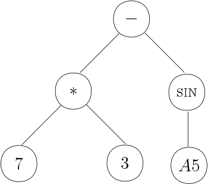

# HandsOnEngine

HandsOnEngine is a JavaScript engine for efficient processing of formulas in spreadsheets

## What to use it for?

You can use HandsOnEngine for processing spreadsheet-like data and formulas in various ways:
- as a standalone tool
- as a service via an API, embedded in a bigger system
- as a spreadsheet, while combined with suitable UI

## Overview

Processing a spreadsheet consists of three phases:

1. Parsing and construction of ASTs - we need to parse the provided formulas and represent them as so-called Abstract Syntax Tree. For example, AST for 
"7*3-SIN(A5)" looks as follows:



2. Construction of dependency graph - we need to understand the relationship between the cells and find the order of processing them. For example if we have C1=A1+B1, then we need to process first A1 and B1 and then C1.

3. Evaluation - it is crucial to evaluate all cells efficiently. For simple expressions there is no big room for maneuver, but for instance a plenty of SUMs on big ranges needs more attention.

You can find the more detailed description below.

## Examples


## Installation

Note: make sure, that you use a recent (at least 10.x) version of node js. We observed a significant performance drop even in some 8.x versions.

Install yarn:

```
npm install -g yarn
```

Install all dependencies:

```
make setup
```

Run tests to make sure that everything is working properly:
```
make test
```

## Basic usage

You can use the following script to process a CSV file with formulas and output a CSV file with values.
If you want to compare results of our engine with values computed by another spreadsheet, you can use the second script.

### Config file

First, there are various parameters that you might want to edit in the [Config file](src/Config.ts):

- CSV_DELIMITER - delimiter between entries in CSV file (default: '.')
- FUNCTION_ARG_SEPARATOR - separator between the arguments of functions (default: ',')
- LANGUAGE - language, currently only English supported (default: 'EN"')
- DATE_FORMAT - what date format do you use (default: 'MM/DD/YYYY')


### handsonengine-convert

This script provides converter from CSV with formulas (exported from other tool) to CSV with values computed by our engine.

Usage:

```
yarn ts-node bin/handsonengine-convert formulas.csv ours.csv
```

The last argument is optional and represent columns to be ignored in final diff. That argument are zero-based, comma-separated indexes of columns, so for example `0,3,7` tells the script to ignore columns `A`, `D` and `H`.


### handsonengine-diff

This script provides a diff tool between 3 csv files: formulas csv file, expected values csv file (exported from other tool) and with another CSV computed by our engine.

Usage:

```
yarn ts-node bin/handsonengine-diff formulas.csv expected-values.csv ours.csv 0,3,7
```

The last argument is optional and represent columns to be ignored in final diff. That argument are zero-based, comma-separated indexes of columns, so for example `0,3,7` tells the script to ignore columns `A`, `D` and `H`.

## Errors

Not every cell can be correctly evaluated. In such case, our engine returns one of the following errors:

- DIV0 - division by zero
- CYCLE - the cell belongs to a cyclic dependency
- REF - reference to a non-existing address (i.e. OFFSET(A1,-1,-1))
- NAME - unknown function name or parsing lub tokenization error (i.e. =A-100)
- VALUE - wrong type of an arguments (i.e. 5+”aa”)
- NUM - problem with computing the answer (i.e. ACOS(5)=?) 
- NA - wrong number of arguments of a function

## Detailed description

### Parsing - grammar
### Dependency graph + repetitive ASTs
### Handling ranges
### Cumulative sums

## Dependencies

Our engine currently depends on the following packages:
- [Chevrotain](http://sap.github.io/chevrotain/docs/)
- [csv-parser](https://www.npmjs.com/package/csv-parser)
- [csv-stringify](https://www.npmjs.com/package/csv-stringify)
- [Moment](https://momentjs.com/)

## License
